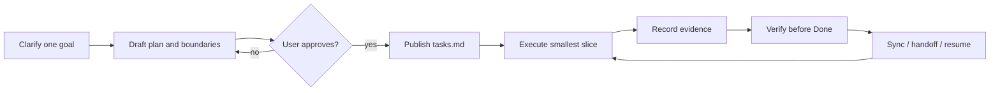

# Codex Mission Center

[](https://github.com/Gale0418/Codex-Mission-Center/actions/workflows/ci.yml)
[](LICENSE)
[](.codex-plugin/plugin.json)
[](rust/rust-toolchain.toml)

**Turn an unclear goal into a local, reviewable, evidence-backed task workspace for Codex.**

Mission Center is an offline, file-based Codex plugin and skill for one project at a time. It clarifies intent, drafts a rolling plan for approval, preserves causal handoffs, and keeps verification close to the task data. It is not a hosted project-management service and is not a `pip` or `npm` package.

<p align="center">
  
</p>
<p align="center"><em>Local file-snapshot HUD from Mission Center 0.5.1; it shows bounded repository evidence, not global live-sensor coverage.</em></p>

<p align="center">
  
</p>

<p align="center"><strong><a href="#quick-start">Start locally</a></strong> · <a href="README.zh-TW.md">繁體中文</a> · <a href="skills/mission-center/SKILL.md">Read the skill contract</a></p>

## Is this for you?

Mission Center fits work that benefits from an explicit goal, bounded decisions, a durable handoff, or repeatable completion evidence:

- multi-day work that must survive a new thread or a context reset;
- projects split across several approved agents or stages;
- risky changes where stale, contradictory, corrupt, or falsely-claimed `Done` states need a gate;
- local planning where Markdown files should remain inspectable, diffable, and portable.

For a short, single-turn task, bare Codex is usually simpler and cheaper. Mission Center adds a workspace and process; use it when that continuity is worth the overhead.

## Keep the North Star across long-running work

Mission Center is designed to preserve more than a checklist. The approved goal, boundaries, decisions, evidence, active lessons, and daily history stay in the project workspace so a worker can keep the same North Star across long-running work instead of depending on one conversation context.

That durable project memory also helps when an old problem comes back. A worker can search `daily-log.md`, `critical-lessons.md`, `decisions.md`, and task evidence for a failure or workaround discovered days earlier, then route around the known pit instead of paying to rediscover it.

A real dogfood example happened in [MediBuddy](https://github.com/Gale0418/MediBuddy/blob/21111ff21abab34e2a613dc4cdc7e4f7cbcb8a14/MissionCenter/daily-log.md). On 2026-09-08, the operator no longer remembered how a previous worker had staged the production Worker rollout. The new worker recovered the existing `v5d` / migration `0027` / `T52E` pending-release lineage from Mission Center history, then continued with migrations `0028` and `0029`, a 100% Worker rollout, 207 tests, typecheck, migration checks, and an iPhone LINE mirror check. Older logs had also preserved deployment pitfalls such as D1 migration history, Wrangler OAuth, and a `jsrsasign` global-scope startup failure whose workaround was a request-time dynamic import.

This is not a claim that the model itself remembers everything for ten days or forever. The continuity comes from explicit, inspectable project state that survives worker changes, new threads, context resets, and long gaps between attempts. If a lesson was never recorded, Mission Center cannot recover it by magic.

## The workflow



## Truth and boundaries

Mission Center is deliberately narrow:

> **Rust-only stable (0.5.1):** the formal Plugin front door is the
> versioned `mission-center` Rust CLI and its four-platform frozen package.
> The Python scripts shown below are compatibility/oracle tooling for
> differential tests and migration diagnostics; they are not included in the
> stable Plugin package and are never a runtime fallback.

- **Per-project and local:** `MissionCenter/tasks.md` is the only task lifecycle truth. `brief.md` and `working-set.md` are rebuildable views; `focus.md`, when present, is a deprecated compatibility view.
- **Runtime is separate:** the optional Runtime/HUD observes an explicitly launched or connected endpoint. It never edits `tasks.md`, task order, status, or the lifecycle source.
- **No global service:** Mission Center is per-project only. Use it inside the current repo/workspace. It creates or reads `./MissionCenter/`. It does not monitor all repositories. It does not merge tasks across projects.
- **Approval is real:** external research, real agent dispatch, LLM classification, and additional budgets are opt-in. Local fixtures and synthetic evaluations are not measurements of production performance.
- **Offline by default:** the formal core is Rust and uses the pinned offline
  toolchain. The optional WebSocket Runtime and Python oracle retain their
  explicit compatibility dependencies; neither is a formal Plugin fallback.

## Quick start

First install Mission Center from this source checkout using the supported wrapper in [Install and publish locally](#install-and-publish-locally). Then open any target repository/workspace in Codex and invoke the installed skill:

```text
Use $mission-center to clarify this goal, ask intake questions first, and create a MissionCenter workspace after I approve the plan.
```

The formal Rust commands below are the supported source-checkout path. The
Python commands are retained only for oracle comparison and migration
diagnostics; they are not generic commands to copy into an arbitrary
repository before installation:

```bash
# Rust formal front door (requires an already-built/selected binary)
mission-center status --root .
mission-center resume --root .
mission-center doctor --root .
```

Compatibility/oracle maintenance:

```bash
# From this repository (source checkout / dogfood maintenance)
python skills/mission-center/scripts/bootstrap_mission_center.py . --language en
python skills/mission-center/scripts/sync_mission_center.py .
python skills/mission-center/scripts/doctor_mission_center.py .
```

The commands above run from this source checkout. With the default plugin-only install, invoking Mission Center through Codex is the normal route. A stable `$CODEX_HOME/skills/mission-center/scripts/` path exists only when installation uses `--with-personal-skill` (or `-WithPersonalSkill`).

For a Traditional Chinese workspace, use `--language zh-TW`. Sync is migration-safe by default; use `--rewrite-summaries` only when you intentionally want Mission Center to regenerate existing `project.md` and `progress.md` summaries. `doctor` treats Done tasks without passing evidence as errors; only entries listed individually in `MissionCenter/legacy-done-audit.json` are downgraded to visible warnings, and they never count as passing smoke tests.

## Install and publish locally

This repository is the authoring source. Formal installation consumes a
verified Rust `frozen-package-v1`; it never builds, downloads, or falls back to
Python. The source-checkout wrappers below are compatibility publishers only
and require an explicit `MISSION_CENTER_PYTHON_COMPAT=1` opt-in. Updating files
in this checkout does not hot-update Codex's installed cache.

Windows (PowerShell):

```powershell
$env:MISSION_CENTER_PYTHON_COMPAT = "1"  # compatibility publisher only
pwsh -ExecutionPolicy Bypass -File ./scripts/install-windows.ps1
```

macOS / Linux:

```bash
MISSION_CENTER_PYTHON_COMPAT=1 bash ./scripts/install-unix.sh
```

The plugin already packages the Mission Center skill. To also create the legacy standalone personal Skill compatibility copy, opt in explicitly:

```powershell
pwsh -ExecutionPolicy Bypass -File ./scripts/install-windows.ps1 -WithPersonalSkill
```

```bash
bash ./scripts/install-unix.sh --with-personal-skill
```

By default, the wrappers also remove an existing standalone personal Skill only when it exactly matches the managed copy. A modified or user-owned copy is preserved and stops the upgrade with an actionable error.

The explicit compatibility entry points `scripts/install.py` and
`scripts/install.ps1` also register the plugin by default when
`MISSION_CENTER_PYTHON_COMPAT=1` is set. Without that opt-in they fail closed;
use a verified Rust package for formal installation.

The Rust stable release can register an already verified marketplace tree without a
Codex CLI or external browser: `mission-center install register apply
--plugin-root <absolute-marketplace>/plugins/mission-center
--marketplace-root <absolute-marketplace> --operation-id <id> --version 0.5.1`.
The resulting receipt supports exact replay, `register rollback`, and
`register reconcile`.

Preview or verify the derived targets without writing them:

```bash
python scripts/publish_local.py --repo . \
  --marketplace-plugin ~/.codex/local-marketplaces/mission-center/plugins/mission-center \
  --dry-run

python scripts/publish_local.py --repo . \
  --marketplace-plugin ~/.codex/local-marketplaces/mission-center/plugins/mission-center \
  --verify
```

On Windows, set equivalent absolute paths or use the wrapper defaults under `%CODEX_HOME%` / `%USERPROFILE%\.codex`. The Windows wrapper adds `--register` for `--write`; registration refreshes the cachebuster-backed installed plugin and requires a resolvable Codex CLI. If you only need the published files and do not have a resolvable CLI, run `publish_local.py --write` without `--register`:

```powershell
python .\scripts\publish_local.py --repo . `
  --marketplace-plugin "$env:USERPROFILE\.codex\local-marketplaces\mission-center\plugins\mission-center" `
  --write
```

Pass `--personal-skill <path-ending-in-skills/mission-center>` only when the standalone compatibility copy is intentionally required.

## Workspace architecture

The canonical file contract lives in [`workspace_contract.py`](skills/mission-center/scripts/workspace_contract.py). A generated workspace contains these required files:

```text
MissionCenter/
├── brief.md
├── working-set.md
├── critical-lessons.md
├── guardrails.md
├── daily-log.md
├── project.md
├── progress.md
├── tasks.md              # only lifecycle truth
├── decisions.md
├── smoke-tests.md
├── notes.md
├── snapshot.md
├── closeout.md
└── visual-hub.md
```

`brief.md` and `working-set.md` are content-fingerprinted materialized views and may be rebuilt. `critical-lessons.md` keeps active lessons bounded (6 KiB) and points to detailed incident evidence. Guardrail changes require explicit human approval. The repository's own dogfood workspace is intentionally trackable and is checked by CI.

## Optional capabilities

> **Path note:** The commands in this section use a source checkout. A plugin-only install should invoke Mission Center through Codex; opt into the standalone personal Skill only when you need the stable `$CODEX_HOME/skills/mission-center/` manual script path. Pass `--workspace <target-repo>` for the repository you want to observe or analyze. `requirements-runtime.txt` lives at the source-checkout root; install it from that checkout (or an equivalent absolute path) before enabling WebSocket Runtime.

The Python commands below are source-checkout compatibility/oracle tooling;
the formal hook and plugin write path use the Rust CLI.

### HUD and Runtime

The static HUD is generated from task state. For live Runtime data, the Rust CLI can start the bounded loopback companion:

```bash
mission-center hud launch --foreground --root . --port 8765
```

When invoked from a Codex hook, the Rust `hook hud` adapter starts or reuses one healthy
loopback companion for the current workspace and emits a host-managed
`mission-center/hud-side-panel` intent in hook `additionalContext`. The intent
contains a bounded loopback URL and a stable workspace `reuseKey`; it is also
written to `output/mission-center-runtime/hud-side-panel.json`. Codex's local
app-server schema currently exposes no public sidebar/open-URL method, so the
hook cannot promise to open or focus a sidebar during the same turn. A Codex
host may present the URL in its built-in sidebar/preview surface; otherwise use
the clickable URL. The Rust hook never opens Chrome or another external browser;
the Python `hud_autolaunch.py` command is compatibility/oracle tooling only:

```bash
python skills/mission-center/scripts/hud_autolaunch.py show --workspace . --open-browser
```

`--open-browser` is the only external-browser opt-in. The singleton key and
health check prevent a second HUD server for the same workspace; sidebar tab
reuse remains host-managed because no public sidebar bridge is available.

Opening the HTML directly with `file://` is a static fallback only. Browser `fetch`/CORS rules can make live data unavailable in that mode.

Runtime can replay a privacy-safe JSONL fixture, link an explicitly connected agent to a task, or connect to an explicitly launched stdio/WebSocket endpoint. It records bounded metadata rather than prompts, reasoning, complete commands, tool arguments, environment values, or secrets:

```bash
python skills/mission-center/scripts/mission_runtime.py --workspace . replay events.jsonl
python skills/mission-center/scripts/mission_runtime.py --workspace . link --agent agent-id --task MC-009
python skills/mission-center/scripts/mission_runtime.py --workspace . connect --stdio
python -m pip install -r requirements-runtime.txt
python skills/mission-center/scripts/mission_runtime.py --workspace . connect --url ws://127.0.0.1:4500
```

Passive observation does not call a model. Connected agents still use their normal quota; explicitly enabled LLM classification or agent-driven trials must follow their manifest budget. If Runtime or `websockets` is unavailable, the static HUD remains usable.

### Adaptive optimization and bounded evaluation

Optimization is a route, not a promise of a numerical optimum. It needs measurable signals, hard constraints, a budget, and a stopping rule; otherwise Mission Center routes back to research or decision-making. Shadow evaluations are read-only fixture analyses and never auto-adopt a winner:

```bash
python skills/mission-center/scripts/mission_optimizer.py profile \
  --input project-profile.json --output output/mission-center-optimization/profile.json
python skills/mission-center/scripts/mission_optimizer.py route \
  --profile output/mission-center-optimization/profile.json
python skills/mission-center/scripts/mission_optimizer.py shadow \
  --manifest experiment.json --observations observations.json --workspace .
```

Other bounded routes include Pulse/Handoff continuity, Steelman Evolution, Research Portfolio/Saturation, and privacy-safe Shift-Loss self-evaluation. Their artifacts are evidence for review, not automatic task changes or real-world benchmark claims.

## What the evidence says

Mission Center's value is continuity and evidence quality, not a made-up token-saving statistic:

- A short, single continuous task is often cheaper with bare Codex.
- Cross-day, cross-thread, cross-agent work and multi-stage verification are the intended use case.
- This repository has no paired same-model token telemetry, so it cannot support a precise token-savings claim.
- The practical gain is continuity across longer or cross-shift work: causal handoff, revision-bound evidence, and explicit stale / contradictory / corrupt / False Done gates.

## Verification

CI runs the unit suite and a single local workspace check on Ubuntu and Windows with Python 3.11. For a local verification:

```bash
python -m unittest discover -s tests -p "test_*.py" -v
```

The release checklist also covers bootstrap, doctor, publish dry-run, publish verify, and the per-project boundaries: [`RELEASE_CHECKLIST.md`](RELEASE_CHECKLIST.md).

## Docs, security, and license

- Contract and routing: [`skills/mission-center/SKILL.md`](skills/mission-center/SKILL.md)
- Design notes: [`DESIGN.md`](DESIGN.md)
- Supply-chain policy: [`docs/supply-chain-policy.md`](docs/supply-chain-policy.md)
- Privacy: [`PRIVACY.md`](PRIVACY.md)
- Attribution and notices: [`NOTICE.md`](NOTICE.md)
- Release process: [`RELEASE_CHECKLIST.md`](RELEASE_CHECKLIST.md)

Mission Center is independently written and maintained. It is inspired by the workflow concepts of Linear and Superpowers, but it does not include their app integrations, trademarks, code, documentation, icons, or branding.

Released under the [MIT License](LICENSE).
